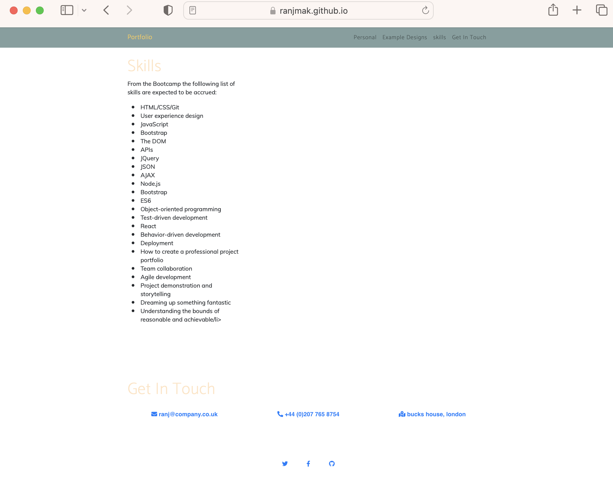

# Bootstrap Portfolio

## Project Description

For this assignment, a portfolio layout is built using HTML and the Bootstrap CSS Framework. The portfolio contains the following sections:

1. Navigation - using Bootstrap navigation, including a hamburger menu for smaller device screens - i.e. the page is responsive.
2. Hero - a jumbotron containing an image, name and a short paragraph (Lorem ipsum text is used throughout the portfolio page)
3. Work -  using bootstrap cards for each project. The work section is diaplayed in a grid and placeholder images (https://placehold.co/) are used for the projects. 

4. Skills - a list of skills expected to be learnt from the bootcamp

5. Contact - list of ways to contact (email, telephone and snail mail)

6. Footer - hyperlinks to social media
    
## Links

The website can be found here: https://ranjmak.github.io/Bootstrap-Portfolio/

The Github repo is found here:  https://github.com/ranjmak/Bootstrap-Portfolio

## Screenshots
The following images are screenshots of the portfolio website:

## Grading Requirements

The grading criteria: 

### Technical Acceptance Criteria: 40%

* Satisfies all of the above acceptance criteria.

### Deployment: 32%

* Application deployed at live URL.

* Application loads with no errors.

* Application GitHub URL submitted.

* GitHub repository contains application code.

### Application Quality: 15%

* Application resembles the functionality of their previous portfolio.

### Repository Quality: 12%

* Repository has a unique name.

* Repository follows best practices for file structure and naming conventions.

* Repository follows best practices for class/id naming conventions, indentation, quality comments, etc.

* Repository contains multiple descriptive commit messages.

* Repository contains quality readme with description, screenshot, link to deployed application.

## Review

You are required to submit BOTH of the following for review:

* The URL of the deployed application.

* The URL of the GitHub repository that contains your code. Give the repository a unique name and include a README file that describes the project.

---

## Copyright

© 2022 edX Boot Camps LLC. Confidential and Proprietary. All Rights Reserved.
